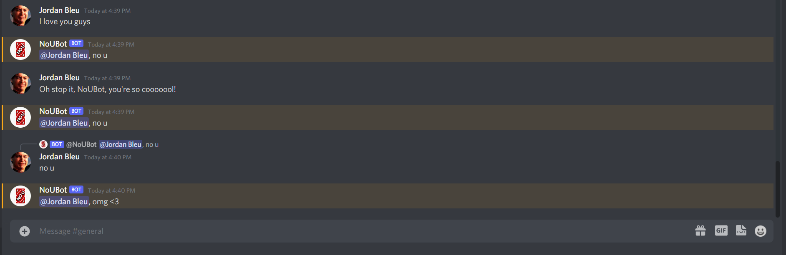

# noubot

Add a bit of wholesomeness (or snarkiness) to your discord server.

## How to run

1. Hit up https://discord.com/developers/applications and create a new application called "NoUBot"

2. In the 'bot' tab, create a bot.  Paste the bot token into the 'main.js' at the bottom of the code.

3. Run the bot in a local node.js server

4. Add the bot to your discord server, making sure it has the proper permissions (send / read messages)

5. say something wholesome to your friends (unless you messed with terms.json)

## terms.json

Each value in terms.json is a RegEx that gets evaluated for each NoUBot reads.  NoUBot uses that to determine if it should 
reply with a 'no u' or not.  

